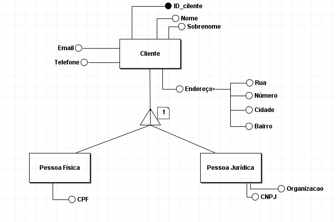
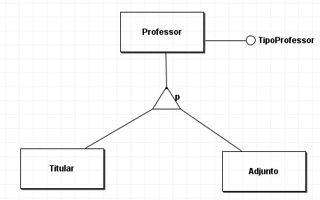
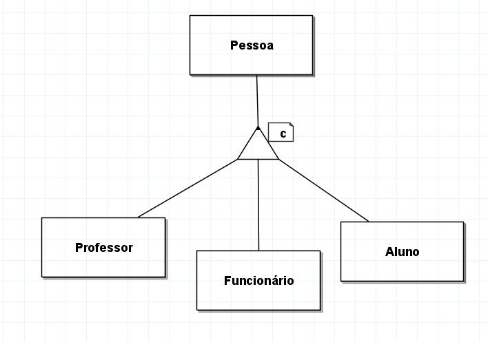

# Introdução a Modelo Entidade Relacionado Estendido(EER)

 
 

<h3>
Neste texto vamos dar uma introdução em Modelo Entidade Relacionado Estendido(EER), onde vamos falar sobre o que é EER e os conceitos os quais ele usa como herança, multiplicidade(uso de cardinalidade), e Generalização-Especialização.
</h3>

#

 
 
 

O Modelo Entidade Relacionado Estendido é uma técnica usada em processos de refinamento dos Modelos conceituais. O EER usa os conceitos de Orientação a Objetos para ajudar nas construções de modelos, nos quais se tratam de aplicações que utilizam linguagens de programações com Orientação a Objetos.

 
 

O EER trabalha com os seguintes conceitos:
- Generalização-Especialização
- Herança;
- Multiplicidade(uso de cardinalidade)

 
 
 

### **Relacionamento de Generalização/Especialização**

 

No conceito de Generalização/especialização, é usado as características da Herança, onde uma ou mais entidades especializadas (também chamada de subclasses ou entidade de nível infeiror), herdam os atributos de uma entidade genérica (também chamada de superclasse ou entidade de nível superior), além dos seus próprios atributos que as entidades especializadas possuem. Vale ser ressaltado que a entidade genérica deve ser a entidade raiz da árvore feita da Generalização/especialização. Na figura abaixo, temos um exemplo clássico usado para demonstrar este conceito:

Como podemos ver no exemplo acima, a entidade especializada Pessoa Física contém, além do seu atributo CPF, todos os atributos que são herdados da entidade genérica Cliente, onde são eles o ID_Cliente, Nome, Sobrenome, Email, Telefone e o atributo multivalorado Endereco.

Os tipos possíveis de generalização/especialização são:

- Total ou parcial que define a obrigatoriedade ou não de ocorrências da entidade genérica
corresponder a uma ocorrência da entidade especializada.

- Exclusiva ou compartilhada que define se uma ocorrência da entidade genérica pode ser
especializada uma ou mais vezes.

 
 

### **Especialização Total**

Na generalização/especialização total, cada vez que dá uma ocorrência da entidade genérica, deverá estar
associada a uma ocorrência de uma de suas entidades especializadas. Esse tipo de especialização/generalização é simbolizado por um "t"ao lado do triângulo que representa a
generalização/especialização entre as entidades. Normalmente, o "t" não aparece ao lado do triângulo, porém nesse exemplo abaixo irá aparecer como forma de visualizar e entender de forma melhor:

O "t" serve como forma de destacar que para todo Cliente, ou ele é uma Pessoa Física ou Pessoa Jurídica.

 
 

### **Especialização Parcial (ou notação linha simples)**

Na Parcial, nem toda ocorrência da entidade genérica (ou superclasse) vai possuir um ocorrência vinda de uma das suas entidades especializadas (ou subclasse)z e o símbolo que representa isso é o "p". Na figura abaixo mostra o mesmo exemplo acima porém sendo parcial.

*Aqui é necessário ter um atributo que indique qual tipo o professor é na entidade genérica, já que estamos tratando de uma especialização parcial. Também é mostrado que nem todo Professor é Titular ou Adjunto.

### **Especialização Exclusiva (x)**
Em uma generalização/especialização exclusiva, a especialização de uma ocorrência de entidade genérica só pode ocorrer no máximo uma vez, onde isso é demonstrado pelas notações que são utilizadas na generalização/especialização total ou parcia. Isso, também, é mostrado na imagem acima.

### **Especialização Compartilhada (c) ou Não Exclusiva**
Quando usamos a generalização/especialização Compartilhada, pode ocorrer que uma ocorrência da entidade genérica apareça várias vezes de suas entidades especializadas. A simbologia para essa descrição é o "c". Assim como na Especialização Total, o "c" pode não aparecer, mas colocarei aqui para ficar visívelmente melhor.

 
 
 

### **Entidade associativa**

Para finalizar, vamos falar sobre Entidade associativa. Basicamente, uma Entidade associativa é uma ré-estruturação de um determinado relacionamento, no qual ele será tratado como se fosse uma entidade. O uso da Entidade associativa vai depender muito da necessidade, de acordo com sua visão, de resolver ou evitar problemas no sistema no momento de seu desenvolvimento e admnistração.

*Poderíamos usar um atributo multivalorado no
relacionamento. 

 
 
Aqui encerra o texto, como foi uma breve introdução a EER, foi tão detalhado assim. Portanto, recomendo ler o livro que está logo abaixo em refências, pois foi a partir dele que construi este texto. 

 
 
 

Referências:
- Modelagem de Banco de Dados, de Paulo Henrique Cayres 

-- Todos os direitos reservados à RNP-Escola Superior de Redes.

- Aula do professor Cláudio Campelo:
https://www.youtube.com/watch?v=l33uVBJVyFs&t=1833s

- Link do vídeo para o youtube: https://youtu.be/kebgHDkwYH0

